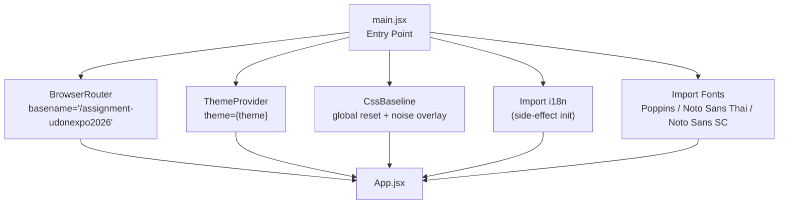
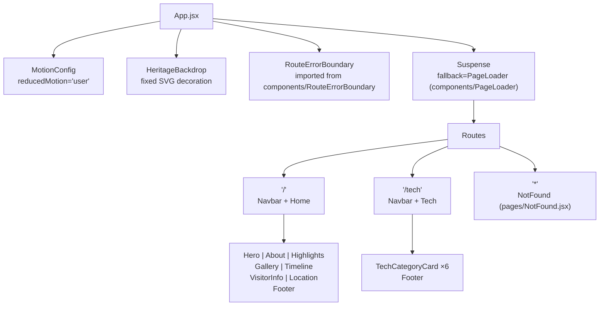
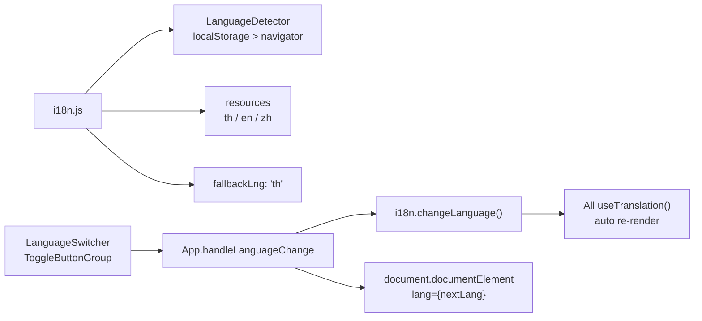
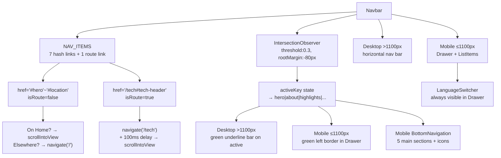
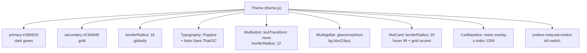
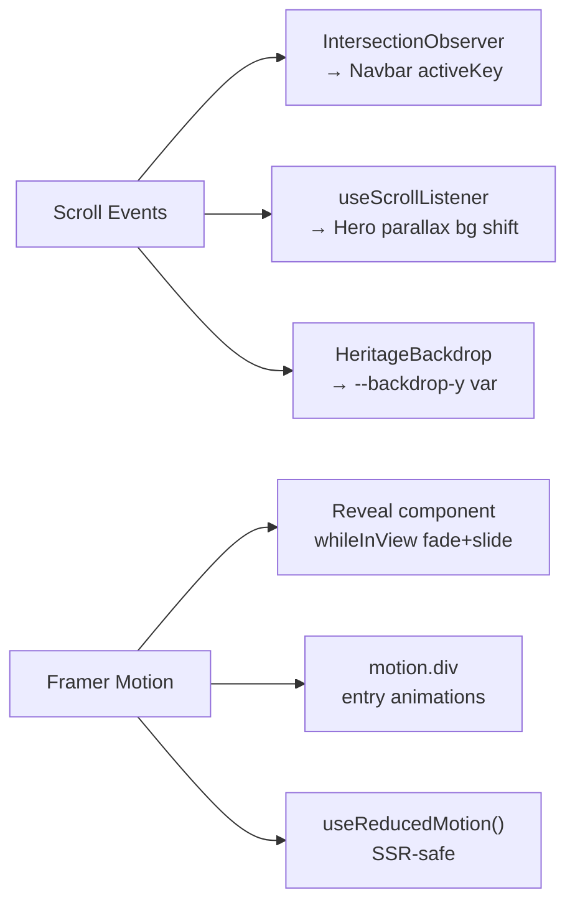
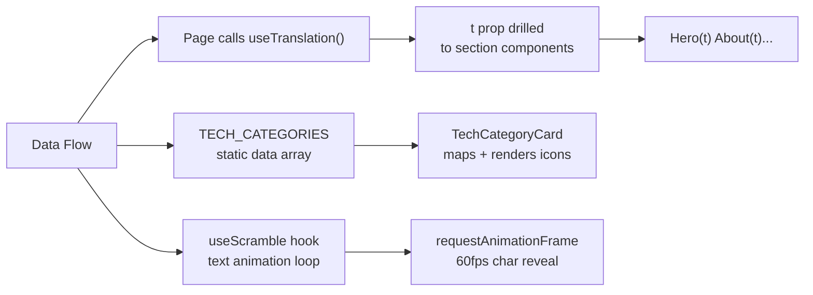
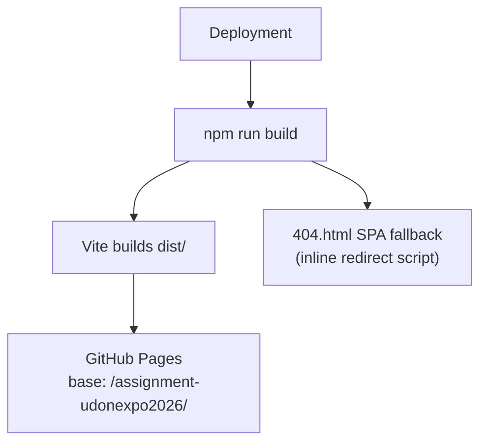
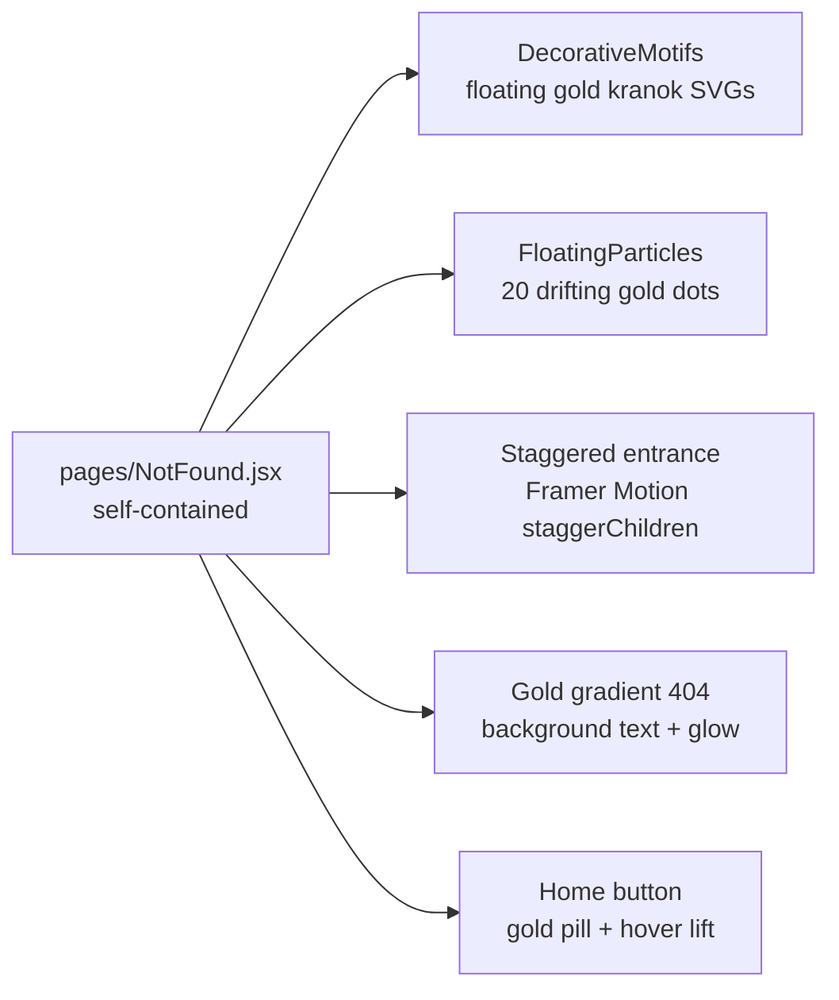

# Udon Expo 2026 — Project Flow

```mermaid
flowchart TD
    A["main.jsx<br/>Entry Point"] --> B["Import i18n<br/>(side-effect init)"]
    A --> C["Import Fonts<br/>Poppins / Noto Sans Thai / Noto Sans SC"]
    A --> D["BrowserRouter<br/>basename='/assignment-udonexpo2026'"]
    A --> E["ThemeProvider<br/>theme={theme}"]
    A --> F["CssBaseline<br/>global reset + noise overlay"]
    D --> G["App.jsx"]
    E --> G
    F --> G
    B --> G
    C --> G
```

```mermaid
flowchart TD
    G["App.jsx"] --> H["MotionConfig<br/>reducedMotion='user'"]
    G --> I["HeritageBackdrop<br/>fixed SVG decoration"]
    G --> J["RouteErrorBoundary<br/>imported from components/RouteErrorBoundary"]
    G --> K["Suspense<br/>fallback=PageLoader (components/PageLoader)"]
    K --> L["Routes"]
    L --> M["'/'<br/>Navbar + Home"]
    L --> N["'/tech'<br/>Navbar + Tech"]
    L --> O["'*'<br/>NotFound (pages/NotFound.jsx)"]
    M --> P["Hero | About | Highlights<br/>Gallery | Timeline<br/>VisitorInfo | Location<br/>Footer"]
    N --> Q["TechCategoryCard ×6<br/>Footer"]
```

```mermaid
flowchart LR
    R["i18n.js"] --> S["LanguageDetector<br/>localStorage > navigator"]
    R --> T["resources<br/>th / en / zh"]
    R --> U["fallbackLng: 'th'"]
    V["LanguageSwitcher<br/>ToggleButtonGroup"] --> W["App.handleLanguageChange"]
    W --> X["i18n.changeLanguage()"]
    X --> Y["All useTranslation()<br/>auto re-render"]
    W --> Z["document.documentElement<br/>lang={nextLang}"]
```

```mermaid
flowchart TD
    AA["Navbar"] --> AB["NAV_ITEMS<br/>7 hash links + 1 route link"]
    AB --> AC["href='#hero'~'#location'<br/>isRoute=false"]
    AB --> AD["href='/tech#tech-header'<br/>isRoute=true"]
    AC --> AE["On Home? → scrollIntoView<br/>Elsewhere? → navigate('/')"]
    AD --> AF["navigate('/tech')<br/>+ 100ms delay → scrollIntoView"]
    AA --> A1["IntersectionObserver<br/>threshold:0.3, rootMargin:-80px"]
    A1 --> A2["activeKey state<br/>→ hero|about|highlights|..."]
    A2 --> A3["Desktop >1100px<br/>green underline bar on active"]
    A2 --> A4["Mobile ≤1100px<br/>green left border in Drawer"]
    A2 --> A5["Mobile BottomNavigation<br/>5 main sections + icons"]
    AA --> AG["Desktop >1100px<br/>horizontal nav bar"]
    AA --> AH["Mobile ≤1100px<br/>Drawer + ListItems"]
    AH --> AI["LanguageSwitcher<br/>always visible in Drawer"]
```

```mermaid
flowchart TD
    AJ["Theme (theme.js)"] --> AK["primary #1B5E20<br/>dark green"]
    AJ --> AL["secondary #C8A64E<br/>gold"]
    AJ --> AM["borderRadius: 16<br/>globally"]
    AJ --> AN["Typography: Poppins<br/>+ Noto Sans Thai/SC"]
    AJ --> AO["MuiButton: textTransform: none<br/>borderRadius: 12"]
    AJ --> AP["MuiAppBar: glassmorphism<br/>bg blur(24px)"]
    AJ --> AQ["MuiCard: borderRadius: 20<br/>hover lift + gold accent"]
    AJ --> AR["CssBaseline: noise overlay<br/>z-index 1299"]
    AJ --> AS["prefers-reduced-motion<br/>kill switch"]
```

```mermaid
flowchart LR
    AT["Scroll Events"] --> AU["IntersectionObserver<br/>→ Navbar activeKey"]
    AT --> AV["useScrollListener<br/>→ Hero parallax bg shift"]
    AT --> AW["HeritageBackdrop<br/>→ --backdrop-y var"]
    AX["Framer Motion"] --> AY["Reveal component<br/>whileInView fade+slide"]
    AX --> AZ["motion.div<br/>entry animations"]
    AX --> BA["useReducedMotion()<br/>SSR-safe"]
```

```mermaid
flowchart LR
    BB["Data Flow"] --> BC["Page calls useTranslation()"]
    BC --> BD["t prop drilled<br/>to section components"]
    BD --> BE["Hero(t) About(t)..."]
    BB --> BF["TECH_CATEGORIES<br/>static data array"]
    BF --> BG["TechCategoryCard<br/>maps + renders icons"]
    BB --> BH["useScramble hook<br/>text animation loop"]
    BH --> BI["requestAnimationFrame<br/>60fps char reveal"]
```

```mermaid
flowchart TD
    BJ["Deployment"] --> BK["npm run build"]
    BK --> BL["Vite builds dist/"]
    BK --> BM["404.html SPA fallback<br/>(inline redirect script)"]
    BL --> BN["GitHub Pages<br/>base: /assignment-udonexpo2026/"]
```

```mermaid
flowchart LR
    BO["pages/NotFound.jsx<br/>self-contained"] --> BP["DecorativeMotifs<br/>floating gold kranok SVGs"]
    BO --> BQ["FloatingParticles<br/>20 drifting gold dots"]
    BO --> BR["Staggered entrance<br/>Framer Motion staggerChildren"]
    BO --> BS["Gold gradient 404<br/>background text + glow"]
    BO --> BT["Home button<br/>gold pill + hover lift"]
```
