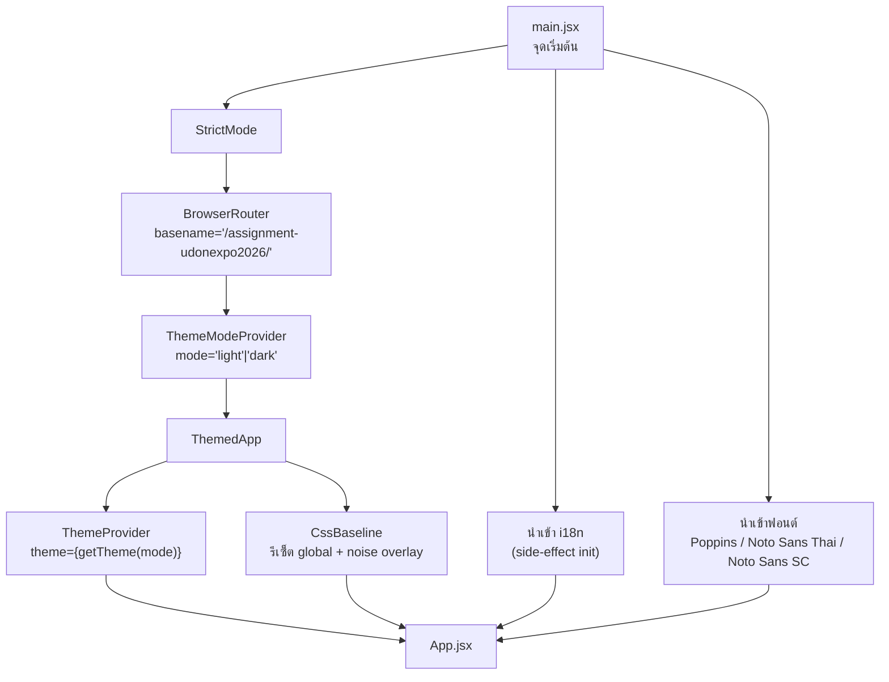
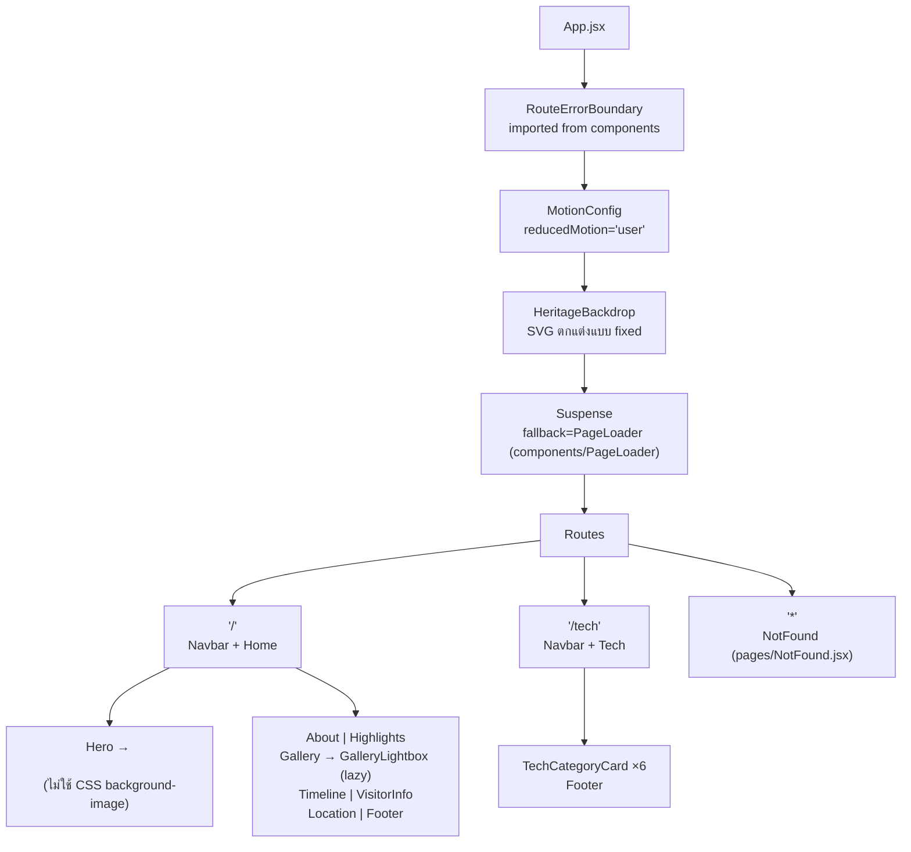
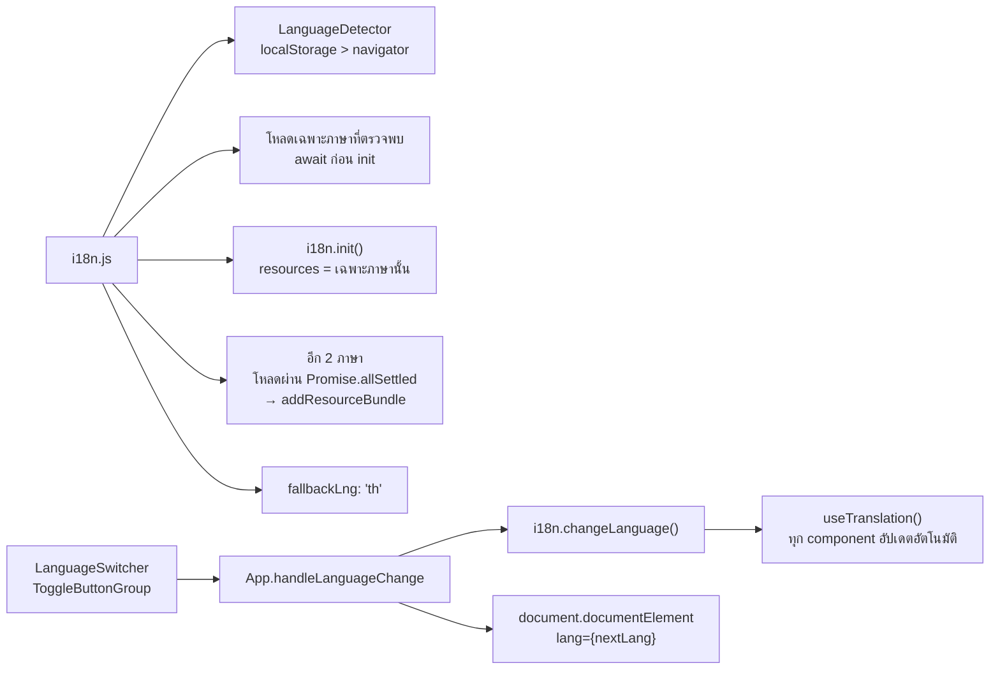
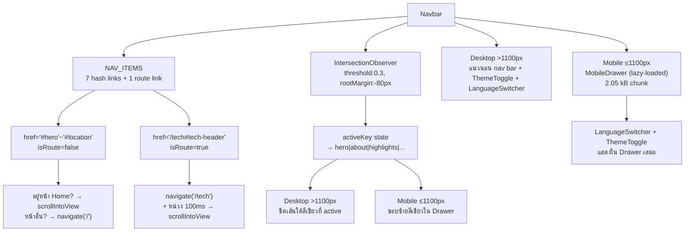
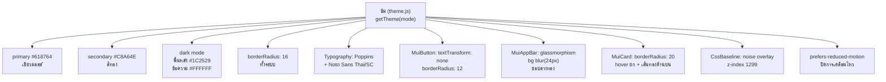
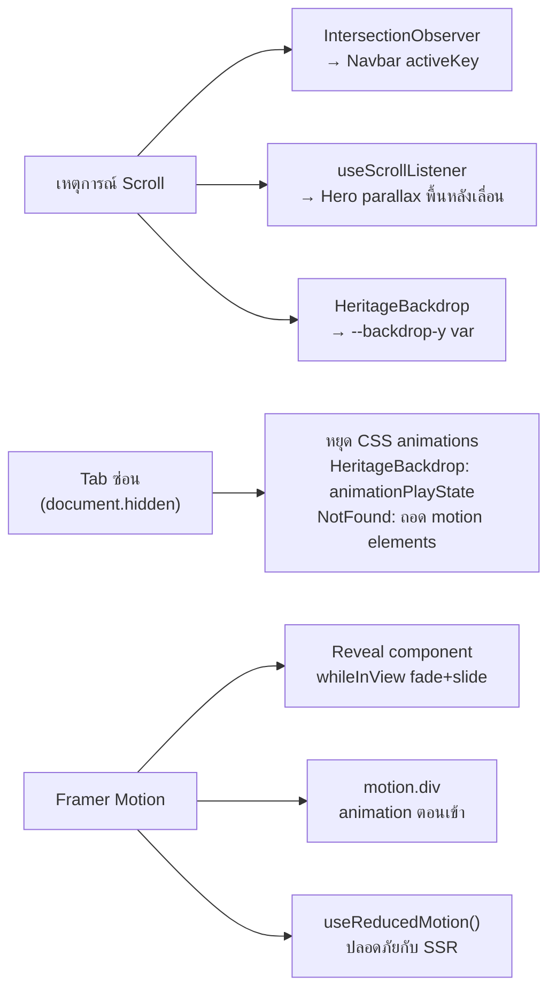
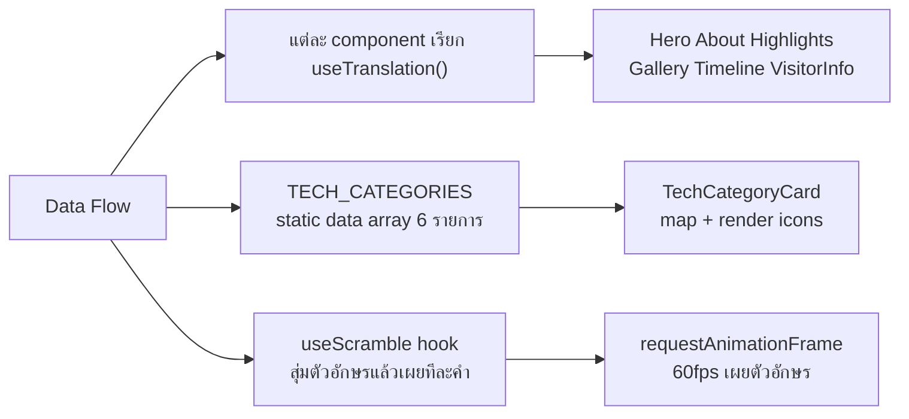
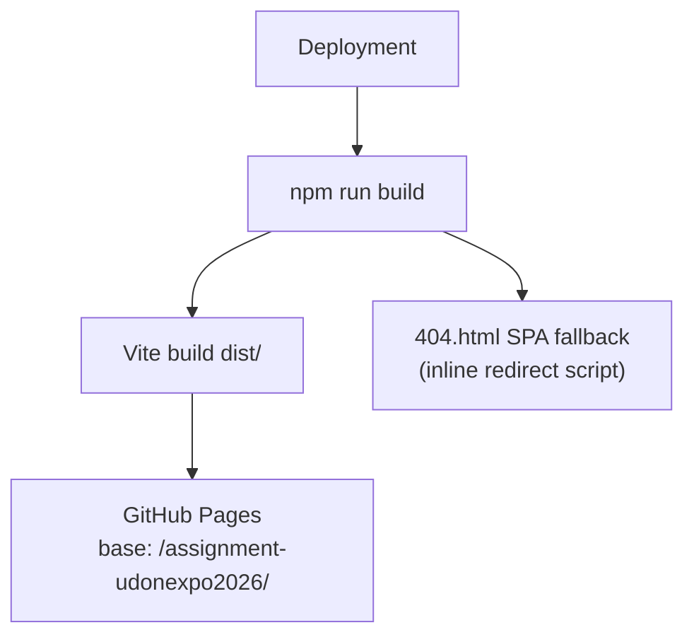
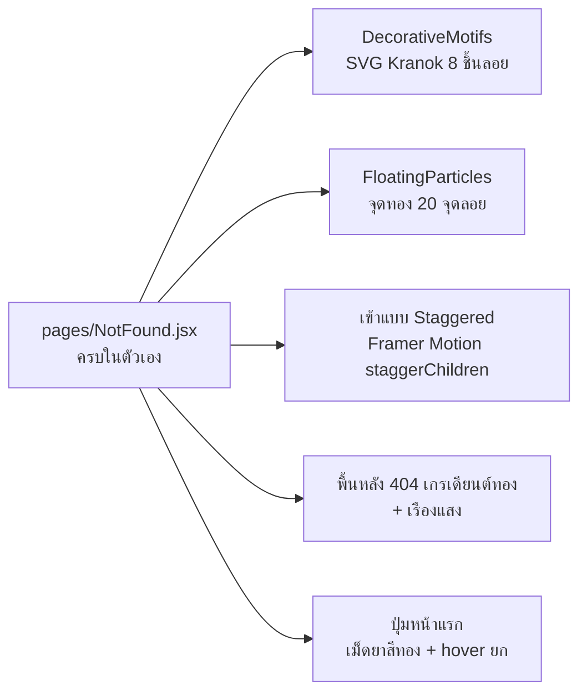

# Udon Expo 2026 — โฟลว์การทำงานของโปรเจกต์

```mermaid
flowchart TD
    A["main.jsx<br/>จุดเริ่มต้น"] --> B["นำเข้า i18n<br/>(side-effect init)"]
    A --> C["นำเข้าฟอนต์<br/>Poppins / Noto Sans Thai / Noto Sans SC"]
    A --> D["StrictMode"]
    D --> E["BrowserRouter<br/>basename='/assignment-udonexpo2026/'"]
    E --> F["ThemeModeProvider<br/>mode='light'|'dark'"]
    F --> G["ThemedApp"]
    G --> G1["ThemeProvider<br/>theme={getTheme(mode)}"]
    G --> G2["CssBaseline<br/>รีเซ็ต global + noise overlay"]
    G1 --> H["App.jsx"]
    G2 --> H
    B --> H
    C --> H
```

```mermaid
flowchart TD
    H["App.jsx"] --> I["RouteErrorBoundary<br/>imported from components"]
    I --> J["MotionConfig<br/>reducedMotion='user'"]
    J --> K["HeritageBackdrop<br/>SVG ตกแต่งแบบ fixed"]
    K --> L["Suspense<br/>fallback=PageLoader (components/PageLoader)"]
    L --> M["Routes"]
    M --> N["'/'<br/>Navbar + Home"]
    M --> O["'/tech'<br/>Navbar + Tech"]
    M --> P["'*'<br/>NotFound (pages/NotFound.jsx)"]
    N --> Q["Hero → <img fetchpriority='high'><br/>(ไม่ใช้ CSS background-image)"]
    N --> R["About | Highlights<br/>Gallery → GalleryLightbox (lazy)<br/>Timeline | VisitorInfo<br/>Location | Footer"]
    O --> S["TechCategoryCard ×6<br/>Footer"]
```

```mermaid
flowchart LR
    T["i18n.js"] --> U["LanguageDetector<br/>localStorage > navigator"]
    T --> V["โหลดเฉพาะภาษาที่ตรวจพบ<br/>await ก่อน init"]
    T --> W["i18n.init()<br/>resources = เฉพาะภาษานั้น"]
    T --> X["อีก 2 ภาษา<br/>โหลดผ่าน Promise.allSettled<br/>→ addResourceBundle"]
    T --> Y["fallbackLng: 'th'"]
    Z["LanguageSwitcher<br/>ToggleButtonGroup"] --> AA["App.handleLanguageChange"]
    AA --> AB["i18n.changeLanguage()"]
    AB --> AC["useTranslation()<br/>ทุก component อัปเดตอัตโนมัติ"]
    AA --> AD["document.documentElement<br/>lang={nextLang}"]
```

```mermaid
flowchart TD
    AE["Navbar"] --> AF["NAV_ITEMS<br/>7 hash links + 1 route link"]
    AF --> AG["href='#hero'~'#location'<br/>isRoute=false"]
    AF --> AH["href='/tech#tech-header'<br/>isRoute=true"]
    AG --> AI["อยู่หน้า Home? → scrollIntoView<br/>หน้าอื่น? → navigate('/')"]
    AH --> AJ["navigate('/tech')<br/>+ หน่วง 100ms → scrollIntoView"]
    AE --> AK["IntersectionObserver<br/>threshold:0.3, rootMargin:-80px"]
    AK --> AL["activeKey state<br/>→ hero|about|highlights|..."]
    AL --> AM["Desktop >1100px<br/>ขีดเส้นใต้สีเขียวที่ active"]
    AL --> AN["Mobile ≤1100px<br/>ขอบซ้ายสีเขียวใน Drawer"]
    AE --> AO["Desktop >1100px<br/>แนวนอน nav bar + ThemeToggle + LanguageSwitcher"]
    AE --> AP["Mobile ≤1100px<br/>MobileDrawer (lazy-loaded)<br/>2.05 kB chunk"]
    AP --> AQ["LanguageSwitcher + ThemeToggle<br/>แสดงใน Drawer เสมอ"]
```

```mermaid
flowchart TD
    AR["ธีม (theme.js)<br/>getTheme(mode)"] --> AS["primary #618764<br/>เขียวมอสส์"]
    AR --> AT["secondary #C8A64E<br/>สีทอง"]
    AR --> AU["dark mode<br/>พื้นหลัง #1C2529<br/>ข้อความ #FFFFFF"]
    AR --> AV["borderRadius: 16<br/>ทั้งระบบ"]
    AR --> AW["Typography: Poppins<br/>+ Noto Sans Thai/SC"]
    AR --> AX["MuiButton: textTransform: none<br/>borderRadius: 12"]
    AR --> AY["MuiAppBar: glassmorphism<br/>bg blur(24px)<br/>ขอบล่างทอง"]
    AR --> AZ["MuiCard: borderRadius: 20<br/>hover ยก + เส้นทองด้านบน"]
    AR --> BA["CssBaseline: noise overlay<br/>z-index 1299"]
    AR --> BB["prefers-reduced-motion<br/>ปิดการเคลื่อนไหว"]
```

```mermaid
flowchart LR
    BC["เหตุการณ์ Scroll"] --> BD["IntersectionObserver<br/>→ Navbar activeKey"]
    BC --> BE["useScrollListener<br/>→ Hero parallax พื้นหลังเลื่อน"]
    BC --> BF["HeritageBackdrop<br/>→ --backdrop-y var"]
    BG["Tab ซ่อน<br/>(document.hidden)"] --> BH["หยุด CSS animations<br/>HeritageBackdrop: animationPlayState<br/>NotFound: ถอด motion elements"]
    BI["Framer Motion"] --> BJ["Reveal component<br/>whileInView fade+slide"]
    BI --> BK["motion.div<br/>animation ตอนเข้า"]
    BI --> BL["useReducedMotion()<br/>ปลอดภัยกับ SSR"]
```

```mermaid
flowchart LR
    BM["Data Flow"] --> BN["แต่ละ component เรียก useTranslation()"]
    BN --> BO["Hero About Highlights<br/>Gallery Timeline VisitorInfo"]
    BM --> BP["TECH_CATEGORIES<br/>static data array 6 รายการ"]
    BP --> BQ["TechCategoryCard<br/>map + render icons"]
    BM --> BR["useScramble hook<br/>สุ่มตัวอักษรแล้วเผยทีละคำ"]
    BR --> BS["requestAnimationFrame<br/>60fps เผยตัวอักษร"]
```

```mermaid
flowchart TD
    BT["Deployment"] --> BU["npm run build"]
    BU --> BV["Vite build dist/"]
    BU --> BW["404.html SPA fallback<br/>(inline redirect script)"]
    BV --> BX["GitHub Pages<br/>base: /assignment-udonexpo2026/"]
```

```mermaid
flowchart LR
    BY["pages/NotFound.jsx<br/>ครบในตัวเอง"] --> BZ["DecorativeMotifs<br/>SVG Kranok 8 ชิ้นลอย"]
    BY --> CA["FloatingParticles<br/>จุดทอง 20 จุดลอย"]
    BY --> CB["เข้าแบบ Staggered<br/>Framer Motion staggerChildren"]
    BY --> CC["พื้นหลัง 404 เกรเดียนต์ทอง<br/>+ เรืองแสง"]
    BY --> CD["ปุ่มหน้าแรก<br/>เม็ดยาสีทอง + hover ยก"]
```
